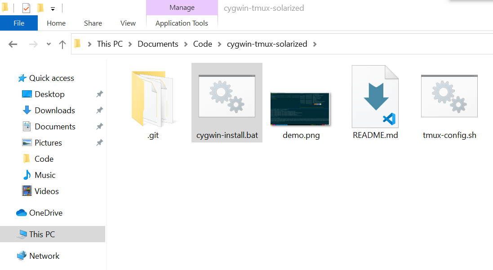
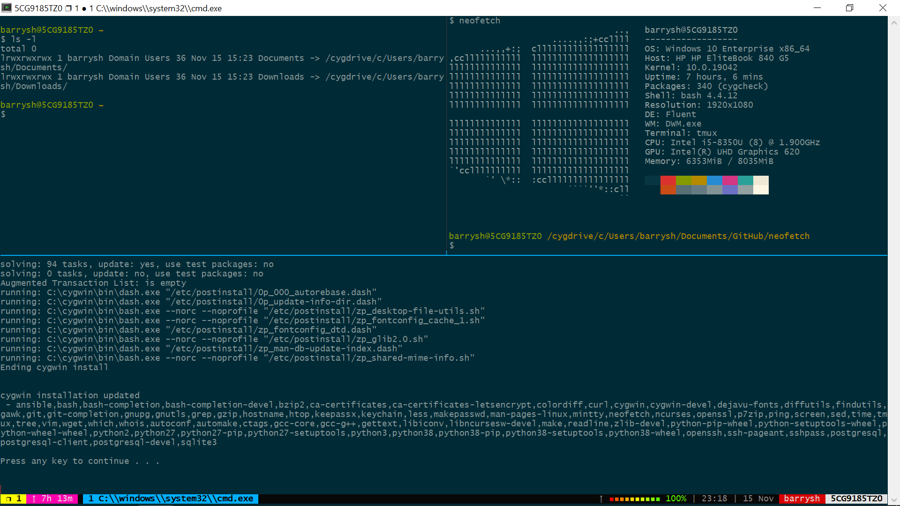

# Cygwin

Cygwin is a large collection of GNU and Open Source tools which provide functionality similar to a Linux distribution on Windows.

# tmux

tmux is an open-source terminal multiplexer for Unix-like operating systems. It allows multiple terminal sessions to be accessed simultaneously in a single window. It is useful for running more than one command-line program at the same time. It can also be used to detach processes from their controlling terminals, allowing remote sessions to remain active without being visible.

## What does this project do?

1. Installs Cygwin with a number of common packages such as curl, wget, ping, etc.
2. Configures a solarized color scheme using ~/.minttyrc
3. Installs oh-my-tmux
4. Compiles neofetch from source 

## Requirements

Download [setup-x86_64.exe](https://cygwin.com/setup-x86_64.exe) and leave it in the Downloads folder

## Do the things!

1. Download the **zip file** from this repository and extract it somewhere.
2. Open the **cygwin-tmux-solarized** folder.
3. Double-click on **cygwin-install.bat** to execute it, no admin privileges are required.

4. **Cygwin64 Terminal** should now be available in the start menu, open it to proceed.
5. In the terminal, navigate to the **cygwin-tmux-solarized** folder from step 2.
- `cd /cygdrive/c/Users/"$(whoami)"/Documents/Code/cygwin-tmux-solarized/`
6. Execute **tmux-config.sh**: `./tmux-config.sh`
7. Close and relaunch **Cygwin64 Terminal**
8. Type `tmux` to begin using **tmux**

### Sources

 - [mintty-colors-solarized](https://github.com/mavnn/mintty-colors-solarized)
 - [oh-my-tmux](https://github.com/gpakosz/.tmux)
 - [neofetch](https://github.com/dylanaraps/neofetch)
